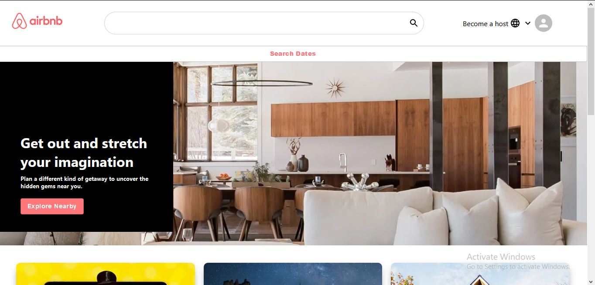

# AIRBNB-CLONE

 

### 1. Firebase link of this project
### 2. [Key Features](#key-features) 
### 3. [Technologies I've used](#technologies-ive-used)
 

## Firebase link of this project:  
   ### See the project here >>>👉   https://airbnb-9713e.web.app/

## Key Features:
    1. By clicking the 'Explore Nearby' option, we can get the list of nearby hotels.    
       
    2. The search date button is for showing a date picker, where we can choose days, dates,
       the number of days we want to book the hotel for and also we can set the number of guests
       to find the desired hotels.
    
    3. Whenever we scroll over the cards of this app, we can see a hover effect.
  
  ### Home Page
  
  
  
  ### Explore Nearby
  
  
  
  ### Date picker
  
  
  
  **[⬆ Back to Top](#airbnb-clone)**

## Technologies I've used:
    1. react => Entire front-end design of this app is made by Reactjs.
    
    2. react-router => to move through te different pages of this app.
    
    3. material-UI => I've used Material-UI to style this application.
    
    4. react-date-range => to choose the dates and date ranges, for the date picker.
        
    5. firebase => to deploy the app
    
    
  **[⬆ Back to Top](#airbnb-clone)**
